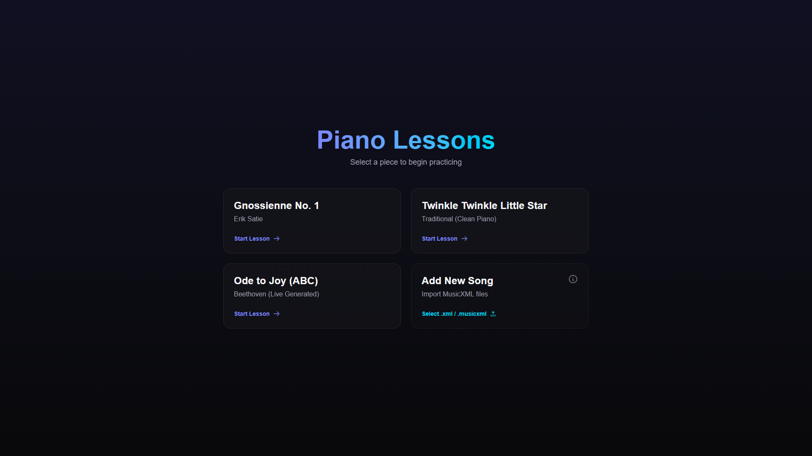
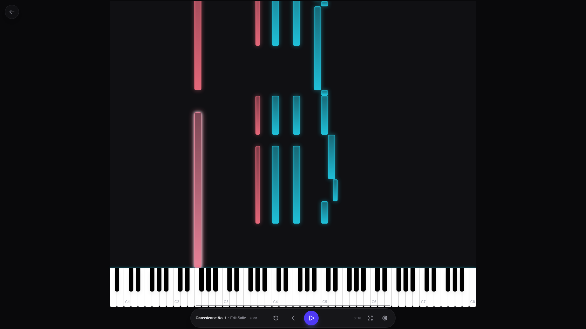
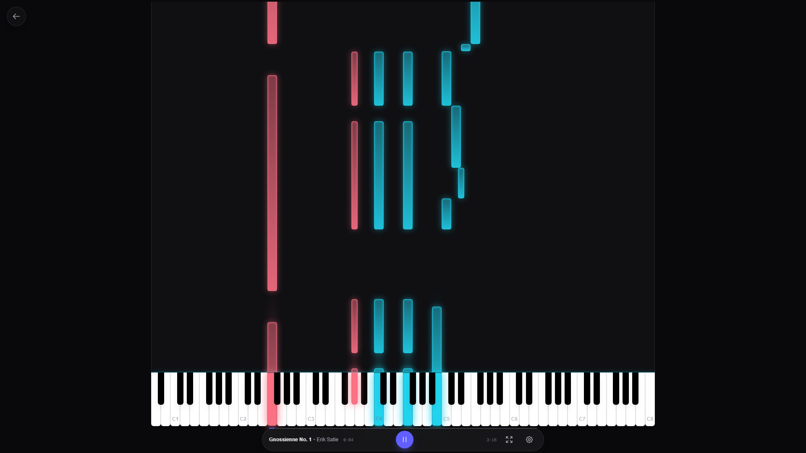

# Piano Lessons

A modern, interactive piano learning application built with Next.js and Web Audio.

[**Live Demo**](https://joris-decombe.github.io/piano_lessons/)



## Overview

`piano_lessons` helps users learn to play piano pieces (starting with "Gnossienne: No. 1" by Claude Debussy) through a real-time visualization interface. It parses standard MIDI files and renders them as falling notes onto a virtual keyboard, allowing for an intuitive "Guitar Hero" style learning experience.

## Features

- **Real-time MIDI Visualization:** "Waterfall" style note rendering synchronized with audio.
- **Interactive Controls:** Play, pause, seek, and adjust playback speed (0.5x - 2.0x).
- **Customizable Visuals:** Split-hand coloring (Left/Right) or unified themes.
- **Responsive Design:** Works on desktop and tablets (landscape mode recommended).
- **Modern Tech Stack:** Built with Next.js 16, React 19, and Tone.js.

## Screenshots

### Landing Page
Choose your piece to begin practicing.


### Player View (Idle)
The main interface features a virtual keyboard and a waterfall display area.



### Active Lesson
Notes fall in sync with the audio. Active keys light up on the virtual keyboard.



## Getting Started

### Prerequisites
*   Node.js (v18+)
*   npm

### Installation

```bash
# Clone the repository
git clone https://github.com/joris-decombe/piano_lessons.git
cd piano_lessons

# Install dependencies
npm install

# Start development server
npm run dev
```

Open [http://localhost:3000/piano_lessons](http://localhost:3000/piano_lessons) in your browser.

> **Note:** The application uses a `basePath` of `/piano_lessons`. All local URLs must include this prefix.

## Development

See [CONTRIBUTING.md](CONTRIBUTING.md) for detailed development instructions, including how to update screenshots and manage MIDI files.

## Release Process

See [RELEASE.md](RELEASE.md) for versioning and release workflow details.

## Tech Stack

*   **Framework:** Next.js 16 (App Router)
*   **Audio:** Tone.js & @tonejs/midi
*   **Styling:** Tailwind CSS 4
*   **Animation:** Framer Motion
*   **Testing:** Vitest (Unit) & Playwright (E2E)

## Testing

### Unit Tests
Run unit tests with Vitest:
```bash
npm test
```

### End-to-End Tests
Run integration tests with Playwright:
```bash
npx playwright test
```

## License

This project is open source.